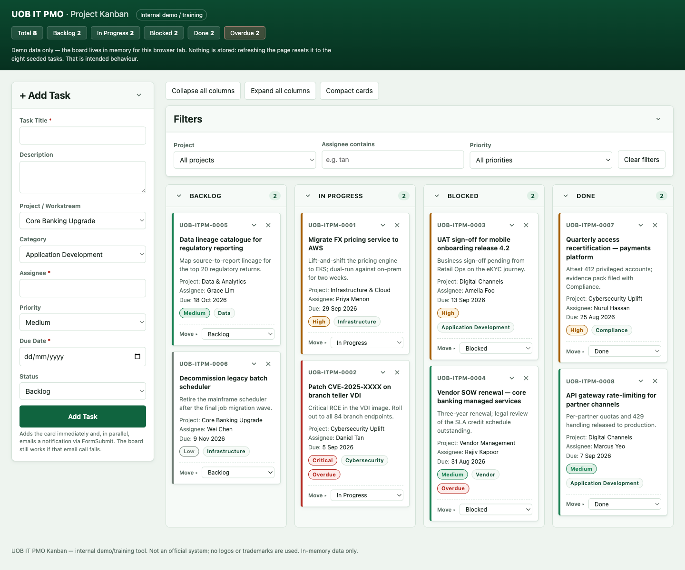
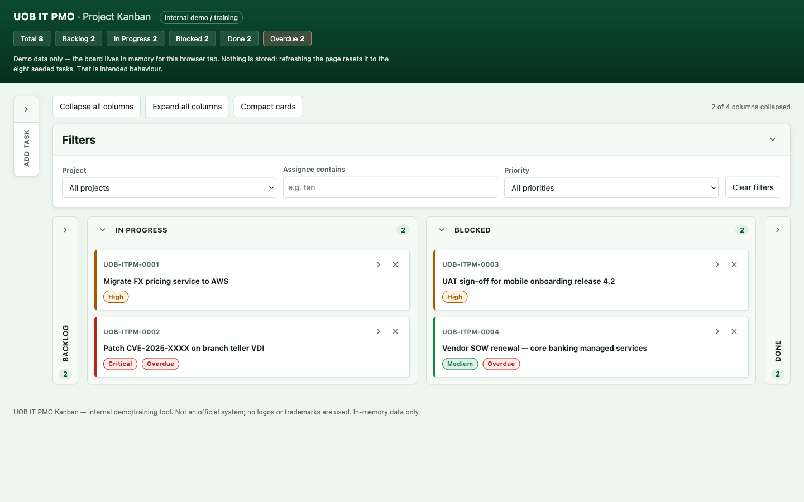
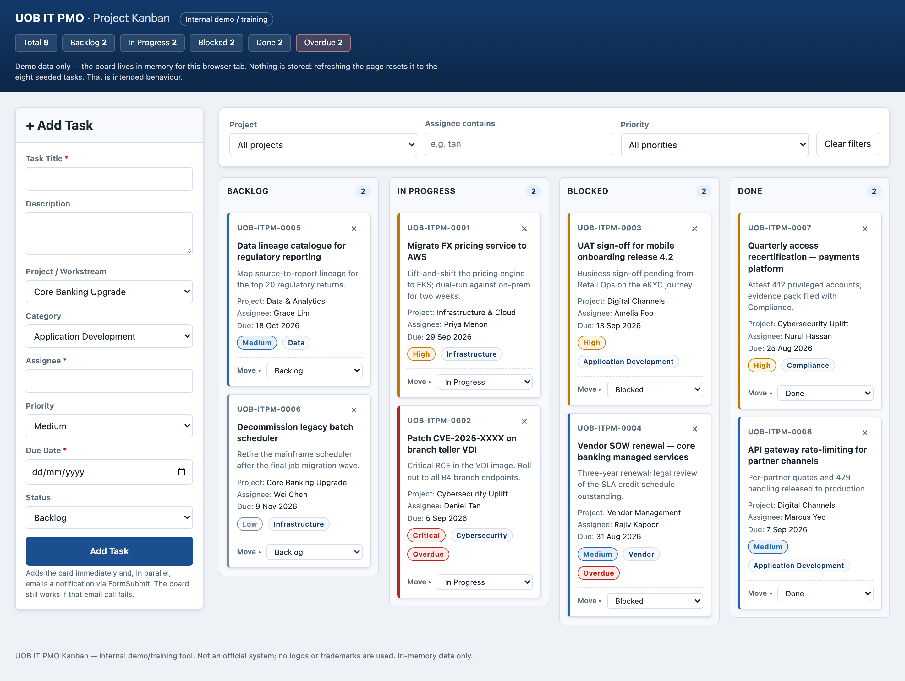

# UOB IT PMO — Project Kanban

A single-page Kanban board for tracking IT project tasks across **Backlog → In Progress → Blocked →
Done**.

> **This is an internal demo / training tool, not a production system.** It is not an official UOB
> application, and it uses no real logos or trademarks. All data is fictional.

**[▶ Live demo](https://learnrt75.github.io/claude/)**



Every region collapses independently — the sidebar and columns fold to labelled rails, and cards
fold to title-plus-priority:



<details>
<summary>Previous blue theme (before the green revamp)</summary>



</details>

## Running it locally

```sh
open index.html
```

That is the whole setup. There is no build step, no package manager, no dependencies, and no server
— the file runs straight from a `file://` URL.

## Features

- Four-column Kanban board with drag-and-drop between columns.
- **Fully keyboard operable** — every drag has a twin "Move ▸" dropdown on the card, so the board
  never requires a mouse.
- Add tasks with inline validation; errors render under each field.
- Filter by project, assignee, and priority.
- Live count badges per column, plus a header summary of totals and overdue items.
- Overdue detection, recomputed from today's date on every render.
- Inline "Delete? Yes / No" confirmation inside the card.
- **Collapse / expand everywhere** — fold the add-task sidebar, the filter panel, any column (to a
  labelled vertical rail), or any card (to title plus priority). "Collapse all columns" and
  "Compact cards" act on the whole board at once.
- Optional email notification on task creation, via FormSubmit.
- Respects `prefers-reduced-motion`, and lays out cleanly from 375px up.

## Security posture

The board is a client-side demo with no auth and no stored data, but it is hardened as a worked
example:

- **Content-Security-Policy** (`<meta>`, so it applies from `file://` too): `default-src 'none'`,
  with `connect-src` allow-listing the FormSubmit origin as the single permitted egress.
- **Output encoding.** Card markup is built as strings, so every interpolated value goes through
  `escapeHtml()`; free text is first run through `sanitizeText()`, which strips control characters
  and Unicode bidirectional overrides used to spoof what a title reads as.
- **Outbound call hardening.** The notification fetch omits credentials, sends no referrer, refuses
  redirects, and aborts after 8s. It is rate-limited, and is skipped entirely while
  `FORMSUBMIT_ENDPOINT` still holds the shipped placeholder — so real task data can never reach an
  address nobody owns.
- **Bounded input.** Length caps, an allow-list check on every select, a due-date window, and a
  200-task board cap.

Two gaps are deliberate and documented in the file rather than papered over: `script-src` must allow
`'unsafe-inline'` (a single file with no build step cannot use hashes), and `frame-ancestors` has to
be a real response header, which GitHub Pages cannot set.

## Design constraints

These are deliberate, and explain why the code looks the way it does:

- **One file.** All markup, CSS, and JS live in `index.html`.
- **Vanilla HTML/CSS/JS.** No framework, no bundler, no build step.
- **Zero external resources.** No CDN scripts, no web fonts, no images in the page itself — icons are
  Unicode glyphs and inline SVG, and typography is a system font stack. The only network call in the
  app is the FormSubmit endpoint.
- **No persistence.** Nothing is written to `localStorage`, cookies, or a server. **Refreshing the
  page resets the board to the eight seeded demo tasks — that is intended behaviour**, and the header
  says so.

## Setup you have to do yourself

Email notification is off by default. To switch it on:

1. In `index.html`, replace the `YOUR_EMAIL@example.com` placeholder in `FORMSUBMIT_ENDPOINT`
   (script section 1) with your address.
2. Add a task once. FormSubmit sends a **one-time activation email** to that address; nothing is
   delivered until you click the link in it.

Card creation never depends on that request — if the email call fails, the card is still added and
you get a warning toast. The hosted demo above always falls through to that toast, because the
sandbox blocks the outbound request.

## Repository layout

| Path | Purpose |
| --- | --- |
| `index.html` | The entire application. |
| `docs/screenshot-green.png` | README screenshot of the current green board. |
| `docs/screenshot-collapsed.png` | README screenshot of the collapse/expand states. |
| `docs/screenshot.png` | Earlier screenshot of the blue theme, kept for reference. |
| `CLAUDE.md` | Guidance for Claude Code when working in this repo. |
| `.github/workflows/deploy-pages.yml` | Publishes the board to GitHub Pages on push to `main`. |
